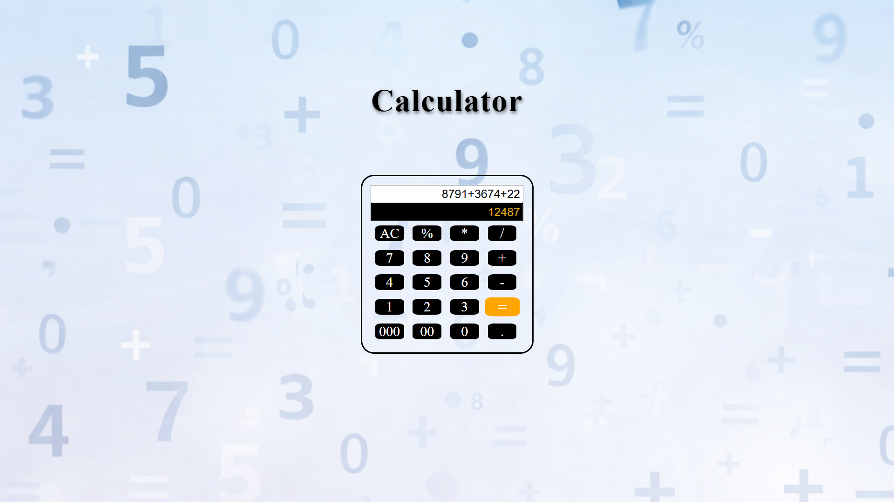

<h1 align="center">🧮✨ Interactive Calculator ✨🧮</h1>

  <a href="https://github.com/visheshgupta0404/Interactive-Calculator">
    🔗 View Project Repository
  </a>

  <b>HTML • CSS • Vanilla JavaScript</b> 
  A modern, interactive calculator with smooth UI animations and full expression support

  

<h2 align="center">🎯 About the Project</h2>

  The <b>Interactive Calculator</b> is a fully functional, browser-based calculator built
  using <b>Vanilla JavaScript</b>. It accurately evaluates mathematical expressions while
  providing a smooth and visually appealing user experience through hover animations
  and transitions.

  ✨ <b>Mission:</b> Build interactive projects that strengthen core JavaScript concepts 
  🔥 <b>Approach:</b> Learn → Build → Optimize → Showcase

<h2 align="center">🚀 Key Features</h2>

<ul>
  <li>🧠 Solves <b>any valid mathematical expression</b></li>
  <li>🔢 Fully functional calculator buttons</li>
  <li>⌨️ Supports both input field and button-based input</li>
  <li>🎯 Accurate real-time calculation and evaluation</li>
  <li>🎨 Smooth hover effects on all buttons</li>
  <li>📈 Button scale animation (<code>scale: 1.2</code>) on hover</li>
  <li>🌈 Dynamic color changes for better UI feedback</li>
  <li>⚡ Clean, responsive, and user-friendly interface</li>
</ul>

<h2 align="center">🛠️ Tech Stack</h2>

<ul>
  <li><b>HTML</b> – Structure of the calculator</li>
  <li><b>CSS</b> – Styling, transitions, and hover effects</li>
  <li><b>JavaScript (Vanilla JS)</b> – Logic, input handling, and expression evaluation</li>
</ul>

<h2 align="center">📂 Project Structure</h2>

<pre>
Interactive-Calculator/
│
├── index.html
├── style.css
├── script.js
├── screenshot.png
└── README.md
</pre>

<h2 align="center">▶️ How to Run</h2>

<b>Step 1:</b> Clone the repository

<pre>
git clone https://github.com/visheshgupta0404/Interactive-Calculator.git
</pre>

<b>Step 2:</b> Open <code>index.html</code> in any modern browser

<b>Step 3:</b> Start calculating 🚀

<h2 align="center">🌱 Learning Outcomes</h2>

<ul>
  <li>Efficient handling of DOM events</li>
  <li>Implementing interactive UI behavior using CSS transitions</li>
  <li>Managing user input through buttons and input fields</li>
  <li>Evaluating mathematical expressions in JavaScript</li>
  <li>Writing clean, modular, and reusable frontend code</li>
</ul>

<h2 align="center">🔮 Future Enhancements</h2>

<ul>
  <li>Add calculation history panel</li>
  <li>Enable keyboard input support</li>
  <li>Introduce scientific calculator features</li>
  <li>Add dark / light theme toggle</li>
  <li>Improve mobile responsiveness</li>
</ul>

<h2 align="center">👤 Author</h2>

  <b>Vishesh Gupta</b> 
  Frontend Development Enthusiast  
  🔗 <a href="https://github.com/visheshgupta0404">GitHub Profile</a> 
  📂 <a href="https://github.com/visheshgupta0404/Interactive-Calculator">Project Repository</a>

<h2 align="center">⭐ Show Your Support</h2>

  If you like this project, consider giving it a ⭐ on GitHub — it really helps!

